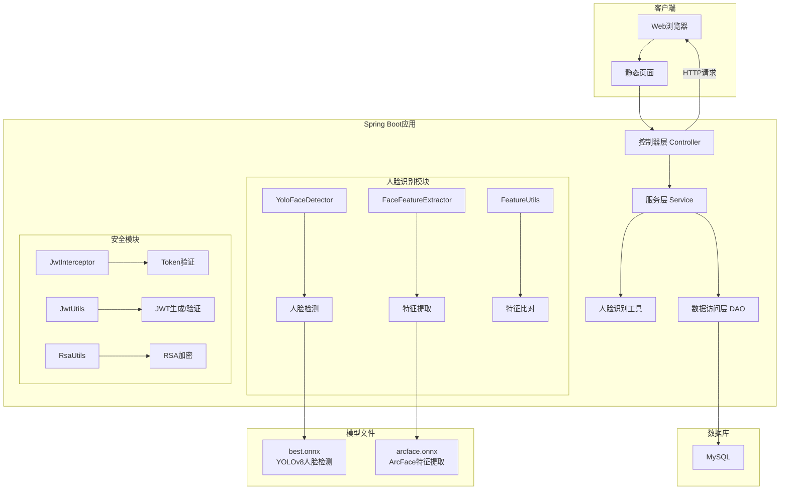

# 01-项目概览

> 学习第一天：2026年4月5日
> 标签：#毕设/人脸识别 #ClaudeCode/learning

## 项目基本信息

- **项目名称**：FaceRecognition-SpringBoot
- **项目类型**：Spring Boot Web应用程序
- **主要功能**：基于人脸识别的考勤管理系统
- **开发环境**：
  - Java 17
  - Spring Boot 3.2.0
  - Maven构建工具
  - MySQL数据库

## 技术栈分析

### 后端框架
- **Spring Boot 3.2.0**：主框架
- **Spring Web**：Web MVC支持
- **Spring Data JPA**：数据库持久层
- **Spring Security Crypto**：密码加密

### 人脸识别技术
- **JavaCV (javacv-platform 1.5.9)**：计算机视觉库
- **ONNX Runtime (onnxruntime 1.19.2)**：机器学习模型推理引擎
- **YOLOv8**：目标检测模型（用于人脸检测）
- **ArcFace**：人脸识别模型（用于特征提取）

### 数据库
- **MySQL**：关系型数据库
- **Spring Data JPA**：ORM框架
- **Hibernate**：JPA实现

### 安全认证
- **JWT (Java JWT 4.4.0)**：JSON Web Token认证
- **Spring Security Crypto**：密码加密工具
- **RSA加密**：自定义RSA工具类

### 开发工具
- **Lombok 1.18.34**：减少样板代码
- **Maven**：依赖管理和构建

## 项目结构分析

### 包结构
```
org.example.facerecognitionspringboot
├── config/          # 配置类
│   └── WebConfig.java
├── controller/      # 控制器层
│   ├── AdminController.java
│   ├── AuthController.java
│   ├── DashboardController.java
│   ├── EmployeeController.java
│   ├── FaceController.java
│   └── LeaveController.java
├── dao/             # 数据访问层
│   ├── AttendanceLogRepository.java
│   ├── DepartmentRepository.java
│   ├── EmployeeRepository.java
│   ├── LeaveRecordRepository.java
│   └── SystemConfigRepository.java
├── entity/          # 实体类
│   ├── AttendanceLog.java
│   ├── Department.java
│   ├── Employee.java
│   ├── LeaveRecord.java
│   └── SystemConfig.java
├── interceptor/     # 拦截器
│   └── JwtInterceptor.java
├── service/         # 服务层
│   └── FaceService.java
├── utils/           # 工具类
│   ├── FaceFeatureExtractor.java
│   ├── FeatureUtils.java
│   ├── JwtUtils.java
│   ├── RsaUtils.java
│   └── YoloFaceDetector.java
└── FaceRecognitionSpringBootApplication.java  # 主启动类
```

### 资源文件结构
```
src/main/resources/
├── application.properties    # 应用配置文件
├── model/                   # 机器学习模型
│   ├── arcface.onnx        # ArcFace人脸识别模型
│   ├── best.onnx           # YOLOv8人脸检测模型
│   └── yolov8n_opset21.onnx # 转换后的YOLO模型
├── static/                  # 静态资源
│   └── index.html          # 前端首页
```

## 配置文件分析

### application.properties
```properties
# 应用配置
spring.application.name=FaceRecognition-SpringBoot
server.port=8080

# MySQL数据库配置
spring.datasource.url=jdbc:mysql://localhost:3306/face_attendance?useUnicode=true&characterEncoding=utf-8&serverTimezone=Asia/Shanghai
spring.datasource.username=root
spring.datasource.password=${DB_PASSWORD}
spring.datasource.driver-class-name=com.mysql.cj.jdbc.Driver

# JPA/Hibernate配置
spring.jpa.show-sql=true
spring.jpa.properties.hibernate.format_sql=true
spring.jpa.hibernate.ddl-auto=update
```

### 模型配置文件
- **convert_model.py**：ONNX模型版本转换工具
- 用于将YOLOv8模型转换为ONNX格式并调整opset版本

## 数据库设计

### 主要实体
1. **Employee**：员工信息
2. **Department**：部门信息
3. **AttendanceLog**：考勤记录
4. **LeaveRecord**：请假记录
5. **SystemConfig**：系统配置

### 业务逻辑
- 员工通过人脸识别打卡考勤
- 管理员管理员工信息和部门
- 请假申请和审批流程
- 考勤统计和报表

## 系统架构图



## 关键业务流程

### 人脸识别考勤流程
1. 员工上传人脸图片
2. YOLOv8检测人脸位置
3. ArcFace提取人脸特征向量
4. 与数据库中已注册员工特征比对
5. 识别成功则记录考勤

### 用户认证流程
1. 用户登录获取JWT Token
2. Token存储在客户端
3. 后续请求通过JwtInterceptor验证
4. 验证通过则允许访问受保护资源

## 学习要点

### 已掌握内容
1. 项目整体架构和模块划分
2. 技术栈组成和版本信息
3. 包结构和代码组织方式
4. 配置文件的作用和配置项
5. 数据库表结构和关系

### 待深入理解
1. 人脸识别算法的具体实现
2. ONNX模型在Java中的加载和使用
3. Spring Security和JWT的集成方式
4. 业务逻辑的完整流程
5. 前端与后端的交互方式

---

> 下一篇：[02-控制器层分析.md]()
> 返回：[学习笔记首页](../README.md)