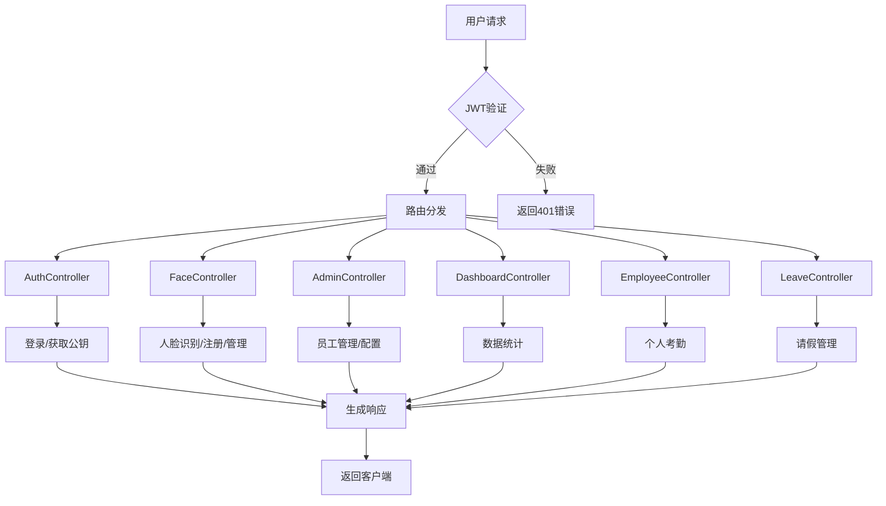

# 02-控制器层分析

> 学习第二天：2026年4月5日  
> 学习阶段：第4-6天（核心模块逐层拆解）  
> 标签：#毕设/人脸识别 #ClaudeCode/learning

## 概述

控制器层（Controller）是Spring Boot应用的**请求入口层**，负责接收HTTP请求、调用业务逻辑、返回响应。本项目的控制器层包含6个主要Controller，分别处理不同的业务模块。

## 安全认证机制

### JWT拦截器 (JwtInterceptor)
**文件位置**：`interceptor/JwtInterceptor.java`

**功能**：验证请求中的JWT Token，保护API接口

**拦截逻辑**：
1. 放行OPTIONS预检请求（CORS）
2. 从`Authorization`请求头获取Token（格式：`Bearer <token>`）
3. 使用`JwtUtils.verifyToken()`验证Token有效性
4. 验证失败返回401状态码和JSON错误信息

### Web配置 (WebConfig)
**文件位置**：`config/WebConfig.java`

**拦截器配置**：
```java
registry.addInterceptor(new JwtInterceptor())
    .addPathPatterns("/api/**")  // 拦截所有/api路径
    .excludePathPatterns(
        "/api/auth/login",        // 登录接口
        "/api/auth/face-login",   // 人脸登录（暂未实现）
        "/api/auth/public-key"    // 获取RSA公钥
    );
```

## 控制器详细分析

### 1. AuthController - 认证控制器
**文件位置**：`controller/AuthController.java`  
**基础路径**：`/api/auth`

| 方法 | HTTP方法 | 路径 | 参数 | 返回值 | 功能描述 |
|------|----------|------|------|--------|----------|
| `getPublicKey()` | GET | `/public-key` | 无 | `{success, publicKey}` | 获取RSA公钥，用于前端加密密码 |
| `login()` | POST | `/login` | `username`, `password` | `{success, message, id, username, role, token}` | 用户登录，验证密码并生成JWT Token |

**核心逻辑**：
1. **RSA密钥对生成**：`@PostConstruct`初始化时生成RSA密钥对，私钥存储在内存中，公钥通过API提供给前端
2. **密码验证流程**：
   - 前端使用RSA公钥加密密码
   - 后端使用RSA私钥解密得到明文密码
   - 使用`BCryptPasswordEncoder`验证密码哈希
3. **Token生成**：登录成功后调用`JwtUtils.generateToken()`生成JWT Token

**安全特性**：
- RSA传输加密 + BCrypt存储加密双重保护
- 密码不在网络上明文传输
- 数据库存储的是BCrypt哈希值

### 2. FaceController - 人脸识别控制器
**文件位置**：`controller/FaceController.java`  
**基础路径**：`/api`

| 方法 | HTTP方法 | 路径 | 参数 | 返回值 | 功能描述 |
|------|----------|------|------|--------|----------|
| `detectFace()` | POST | `/detect` | `file` (图片文件) | 字符串结果 | 人脸检测和识别，用于打卡 |
| `register()` | POST | `/register` | 多个参数和图片文件 | 字符串结果 | 员工注册，录入人脸特征 |
| `getFaceThreshold()` | GET | `/admin/config/face-threshold` | 无 | 阈值字符串 | 获取人脸识别阈值 |
| `updateFaceThreshold()` | POST | `/admin/config/face-threshold` | `value` | 字符串结果 | 更新人脸识别阈值 |
| `getDepartments()` | GET | `/admin/departments` | 无 | 部门列表 | 获取所有部门 |
| `addDepartment()` | POST | `/admin/department/add` | `name` | 字符串结果 | 添加新部门 |
| `deleteDepartment()` | POST | `/admin/department/delete` | `id` | 字符串结果 | 删除部门 |
| `updateEmployeeDepartment()` | POST | `/admin/employee/department` | `empId`, `deptId` | 字符串结果 | 调整员工部门 |
| `getAllAttendances()` | GET | `/admin/attendance/all` | 无 | 考勤记录列表 | 获取所有考勤记录 |

**核心功能**：
1. **人脸检测和识别** (`/detect`)：
   - 活体检测：计算图像清晰度，防止屏幕翻拍
   - YOLOv8人脸检测：定位人脸位置
   - ArcFace特征提取：提取512维特征向量
   - 特征比对：在数据库中查找最匹配的员工

2. **员工注册** (`/register`)：
   - 要求至少3张连拍照片
   - 多张照片特征融合（L2归一化平均）
   - 密码BCrypt加密存储
   - 人脸特征向量存储到数据库

3. **管理功能**：
   - 部门管理：增删查改
   - 人脸识别阈值配置
   - 员工部门调整
   - 考勤记录查看

**技术亮点**：
- **活体检测**：基于Laplacian方差计算图像清晰度
- **多特征融合**：多张照片的特征向量融合提高识别准确率
- **模型初始化**：`@PostConstruct`初始化YOLO和ArcFace模型

### 3. AdminController - 管理员控制器
**文件位置**：`controller/AdminController.java`  
**基础路径**：`/api/admin`

| 方法 | HTTP方法 | 路径 | 参数 | 返回值 | 功能描述 |
|------|----------|------|------|--------|----------|
| `getAllEmployees()` | GET | `/employees` | 无 | 员工列表（脱敏） | 获取所有员工信息（去除密码和特征） |
| `updateRole()` | POST | `/role/update` | `id`, `role` | `{success, message}` | 更新员工角色 |
| `getEmployeeAttendance()` | GET | `/attendance/{empId}` | `empId` | 考勤记录列表 | 获取指定员工的考勤记录 |
| `getCheckInTime()` | GET | `/config/checkin-time` | 无 | 时间字符串 | 获取上班时间配置 |
| `setCheckInTime()` | POST | `/config/checkin-time` | `time` | `{success}` | 设置上班时间 |
| `getCheckOutTime()` | GET | `/config/checkout-time` | 无 | 时间字符串 | 获取下班时间配置 |
| `setCheckOutTime()` | POST | `/config/checkout-time` | `time` | `{success}` | 设置下班时间 |
| `deleteEmployee()` | POST | `/employee/delete` | `id` | `{success, message}` | 删除员工 |
| `addLeave()` | POST | `/leave/add` | 多个参数 | `{success, message}` | 管理员手动添加请假记录 |

**核心功能**：
1. **员工管理**：查看、修改角色、删除员工
2. **考勤配置**：上下班时间设置
3. **请假管理**：管理员手动批准请假
4. **数据脱敏**：返回员工列表时去除敏感信息（密码、人脸特征）

**业务逻辑**：
- **请假时间验证**：防止时间冲突和逻辑错误
- **关联数据保护**：删除员工时检查关联数据
- **配置管理**：系统参数存储在`system_config`表

### 4. DashboardController - 数据看板控制器
**文件位置**：`controller/DashboardController.java`  
**基础路径**：`/api/dashboard`

| 方法 | HTTP方法 | 路径 | 参数 | 返回值 | 功能描述 |
|------|----------|------|------|--------|----------|
| `getStatistics()` | GET | `/statistics` | 无 | 统计数据和趋势图 | 获取考勤统计数据 |
| `getAbnormalDetails()` | GET | `/abnormal-details` | 无 | 各类名单详情 | 获取详细的人员分类名单 |

**核心功能**：
1. **考勤统计**：
   - 总人数、今日打卡人数、迟到人数、请假人数、缺勤人数
   - 过去7天的打卡趋势数据

2. **名单分类**：
   - 全员名单
   - 已打卡名单
   - 迟到名单
   - 请假名单
   - 缺勤名单

**数据处理特点**：
- **数据去重**：同一员工多次打卡只统计一次
- **准确计算**：缺勤人数 = 总人数 - 打卡人数 - 请假人数
- **趋势分析**：7天历史数据可视化

### 5. EmployeeController - 员工控制器
**文件位置**：`controller/EmployeeController.java`  
**基础路径**：`/api/employee`

| 方法 | HTTP方法 | 路径 | 参数 | 返回值 | 功能描述 |
|------|----------|------|------|--------|----------|
| `getMyAttendance()` | GET | `/attendance/{empId}` | `empId` | 考勤记录列表 | 员工查看自己的考勤记录 |

**功能特点**：
- 简单的查询接口
- 员工只能查看自己的数据
- 按打卡时间倒序排列

### 6. LeaveController - 请假控制器
**文件位置**：`controller/LeaveController.java`  
**基础路径**：`/api/leave`

| 方法 | HTTP方法 | 路径 | 参数 | 返回值 | 功能描述 |
|------|----------|------|------|--------|----------|
| `applyLeave()` | POST | `/apply` | 多个请假参数 | `{success, message}` | 员工申请请假 |
| `getMyLeaves()` | GET | `/my/{empId}` | `empId` | 请假记录列表 | 员工查看自己的请假记录 |
| `getPendingLeaves()` | GET | `/pending` | 无 | 待审批请假列表 | 获取所有待审批的请假申请 |
| `auditLeave()` | POST | `/audit` | `id`, `status` | `{success}` | 审批请假申请 |

**核心功能**：
1. **请假申请**：员工提交时间段请假申请
2. **请假查询**：员工查看自己的请假历史
3. **请假审批**：管理员审批待处理的请假申请

**业务规则**：
- 请假时间验证：结束时间不能早于开始时间
- 状态管理：`待审批` → `已同意`/`已拒绝`
- 时间格式：`yyyy-MM-dd HH:mm:ss`

## API设计模式分析

### 1. 路由设计
- 所有API以`/api`开头
- 按功能模块划分子路径：`/auth`、`/admin`、`/dashboard`等
- RESTful风格：资源使用名词，操作使用HTTP方法

### 2. 参数传递
- **查询参数**：`@RequestParam`用于简单数据
- **路径参数**：`@PathVariable`用于资源ID
- **文件上传**：`@RequestParam("file") MultipartFile`
- **JSON Body**：未使用`@RequestBody`，主要使用表单参数

### 3. 响应格式
- **成功响应**：包含`success: true`和相关数据
- **错误响应**：包含`success: false`和`message`错误信息
- **数据脱敏**：敏感数据（密码、特征）不返回给前端

### 4. 跨域支持
- 所有Controller使用`@CrossOrigin(origins = "*")`
- 允许所有域名跨域访问（开发环境）

## 安全设计分析

### 1. 认证机制
- **JWT Token**：登录后生成，后续请求在Header中携带
- **Token验证**：`JwtInterceptor`拦截验证
- **免验证接口**：登录、获取公钥等接口不需要Token

### 2. 密码安全
- **传输加密**：RSA非对称加密
- **存储加密**：BCrypt哈希加密
- **密钥管理**：RSA密钥对在服务端生成和存储

### 3. 权限控制
- **角色区分**：`Employee`实体中有`role`字段
- **接口保护**：所有`/api/**`路径默认需要认证
- **数据隔离**：员工只能查看自己的数据

## 代码质量分析

### 优点
1. **分层清晰**：Controller只负责请求处理，业务逻辑委托给Service
2. **异常处理**：基本的try-catch异常捕获
3. **日志输出**：关键操作有System.out.println日志
4. **注释详细**：中文注释清晰，特别是安全相关逻辑

### 改进建议
1. **响应标准化**：可以统一响应格式工具类
2. **参数验证**：缺少输入参数的有效性验证
3. **国际化**：错误消息硬编码为中文
4. **Swagger文档**：缺乏API文档生成

## 业务流程图



## 学习要点

### 已掌握内容
1. **控制器设计模式**：Spring MVC的Controller编写规范
2. **API设计原则**：RESTful风格、参数传递、响应格式
3. **安全机制**：JWT拦截器、RSA加密、BCrypt哈希
4. **业务模块划分**：6个Controller各自负责的业务领域
5. **代码组织结构**：包结构、类职责分离

### 待深入理解
1. **Service层实现**：Controller调用的Service具体实现
2. **人脸识别算法**：YOLO和ArcFace的Java调用细节
3. **数据库操作**：Repository层的查询方法定义
4. **前端交互**：API如何被前端调用和使用
5. **配置管理**：系统配置的存储和读取机制

---

> 上一篇：[01-项目概览.md](../01-项目概览.md)  
> 下一篇：[03-服务层与工具类分析.md](../03-服务层与工具类分析.md)  
> 返回：[学习笔记首页](../README.md)