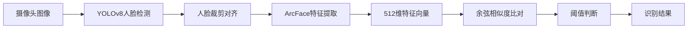
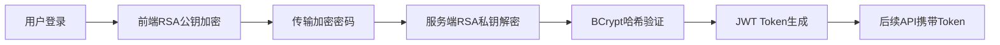

# 03-核心代码解析

> 学习第三天：2026年4月5日  
> 学习阶段：第7-9天（关键代码深度解析）  
> 标签：#毕设/人脸识别 #ClaudeCode/learning

## 概述

本文档深入分析人脸识别系统的**核心算法实现代码**，重点解析：

1. **YoloFaceDetector**：YOLOv8人脸检测算法的Java实现
2. **FaceFeatureExtractor**：ArcFace特征提取算法的Java实现  
3. **FaceService**：人脸识别业务逻辑和特征比对算法
4. **JwtUtils & RsaUtils**：安全认证的核心算法
5. **FeatureUtils**：多特征融合算法

## 1. YoloFaceDetector - YOLOv8人脸检测实现

**文件位置**：`utils/YoloFaceDetector.java`

### 1.1 模型加载和初始化

```java
// 关键代码行：38-64
public YoloFaceDetector() {
    try {
        ClassPathResource resource = new ClassPathResource("model/best.onnx");
        byte[] modelBytes = modelStream.readAllBytes();
        
        // 初始化ONNX Runtime环境
        env = OrtEnvironment.getEnvironment();
        OrtSession.SessionOptions options = new OrtSession.SessionOptions();
        options.setOptimizationLevel(OrtSession.SessionOptions.OptLevel.ALL_OPT);
        
        // 动态获取CPU核心数进行优化
        int threads = Runtime.getRuntime().availableProcessors();
        options.setIntraOpNumThreads(threads);
        
        // 创建推理会话
        session = env.createSession(modelBytes, options);
    }
}
```

**技术要点**：
- 使用**ONNX Runtime**加载YOLOv8模型（`best.onnx`）
- 动态设置线程数优化性能：`Runtime.getRuntime().availableProcessors()`
- 优化级别：`ALL_OPT`（最高级别优化）

### 1.2 图像预处理算法

```java
// 关键代码行：96-151
private PreprocessResult preprocess(Mat src) {
    // 计算缩放比例（保持长宽比）
    float scale = Math.min(INPUT_SIZE * 1.0f / h, INPUT_SIZE * 1.0f / w);
    int newW = Math.round(w * scale);
    int newH = Math.round(h * scale);
    
    // 对称填充计算
    float padX = (INPUT_SIZE - newW) / 2.0f;
    float padY = (INPUT_SIZE - newH) / 2.0f;
    
    // 缩放图像
    opencv_imgproc.resize(src, resized, new Size(newW, newH));
    
    // 创建灰色画布并放置图像
    Mat canvas = new Mat(INPUT_SIZE, INPUT_SIZE, src.type(), new Scalar(114, 114, 114, 0));
    resized.copyTo(canvas.apply(roi));
    
    // BGR转RGB + 归一化
    opencv_imgproc.cvtColor(canvas, rgb, opencv_imgproc.COLOR_BGR2RGB);
    rgb.convertTo(rgb, opencv_core.CV_32FC3, 1.0 / 255.0, 0.0);
    
    // HWC → NCHW格式转换
    float[][][][] nchw = new float[1][3][INPUT_SIZE][INPUT_SIZE];
    for (int y = 0; y < INPUT_SIZE; y++) {
        for (int x = 0; x < INPUT_SIZE; x++) {
            for (int c = 0; c < 3; c++) {
                nchw[0][c][y][x] = data[y * INPUT_SIZE * 3 + x * 3 + c];
            }
        }
    }
}
```

**预处理流程**：
1. **保持长宽比缩放**：长边缩放到640，短边按比例缩放
2. **对称填充**：用灰色(114,114,114)填充到640×640
3. **颜色空间转换**：BGR → RGB（YOLO要求RGB输入）
4. **归一化**：像素值从[0,255]归一化到[0,1]
5. **格式转换**：HWC(height,width,channel) → NCHW(batch,channel,height,width)

### 1.3 模型推理和后处理

```java
// 关键代码行：69-91, 162-207
public RectVector detect(Mat frame) throws OrtException {
    // 1. 预处理
    PreprocessResult preResult = preprocess(frame);
    
    // 2. 创建ONNX张量
    OnnxTensor tensor = OnnxTensor.createTensor(env, preResult.inputTensor);
    
    // 3. 推理
    OrtSession.Result result = session.run(Collections.singletonMap("images", tensor));
    
    // 4. 获取输出 [1, 300, 6]
    float[][][] output = (float[][][]) result.get(0).getValue();
    
    // 5. 后处理
    return postprocess(output, originalWidth, originalHeight,
            preResult.scale, preResult.padX, preResult.padY);
}
```

**后处理算法**：
```java
private RectVector postprocess(float[][][] output, int origW, int origH,
                               float scale, float padX, float padY) {
    // 输出格式自适应：YOLO输出可能是[300,6]或[6,300]
    boolean isTransposed = outMatrix.length < outMatrix[0].length;
    
    for (int i = 0; i < rows; i++) {
        // 解析边界框坐标 (cx, cy, w, h)
        float cx = isTransposed ? outMatrix[0][i] : outMatrix[i][0];
        float cy = isTransposed ? outMatrix[1][i] : outMatrix[i][1];
        float w  = isTransposed ? outMatrix[2][i] : outMatrix[i][2];
        float h  = isTransposed ? outMatrix[3][i] : outMatrix[i][3];
        float conf = isTransposed ? outMatrix[4][i] : outMatrix[i][4];
        
        // 置信度过滤
        if (conf < CONFIDENCE_THRESHOLD) continue;
        
        // 坐标转换：中心点 → 左上角
        float x1 = cx - w / 2.0f;
        float y1 = cy - h / 2.0f;
        
        // 去除填充，缩放回原图尺寸
        x1 = (x1 - padX) / scale;
        y1 = (y1 - padY) / scale;
        float realW = w / scale;
        float realH = h / scale;
        
        // 边界裁剪
        int left = Math.max(0, Math.round(x1));
        int top = Math.max(0, Math.round(y1));
        int right = Math.min(origW, Math.round(x1 + realW));
        int bottom = Math.min(origH, Math.round(y1 + realH));
    }
}
```

**YOLO输出格式**：
- 每个检测框：`[cx, cy, w, h, confidence, class_id]`
- 本项目只检测人脸（单类别），所以`class_id`始终为0
- 置信度阈值：`CONFIDENCE_THRESHOLD = 0.5f`

## 2. FaceFeatureExtractor - ArcFace特征提取

**文件位置**：`utils/FaceFeatureExtractor.java`

### 2.1 模型加载

```java
// 关键代码行：15-30
public FaceFeatureExtractor() {
    String modelPath = "src/main/resources/model/arcface.onnx";
    // 使用OpenCV DNN引擎加载ONNX模型
    this.net = opencv_dnn.readNetFromONNX(file.getAbsolutePath());
}
```

**技术特点**：
- 使用**OpenCV DNN模块**而非ONNX Runtime
- 简化了模型加载过程
- 适合特征提取这种固定输入输出的模型

### 2.2 特征提取算法

```java
// 关键代码行：32-78
public float[] extract(Mat faceImage) {
    // OpenCV的blobFromImage自动完成所有预处理
    Mat blob = opencv_dnn.blobFromImage(
            faceImage,
            1.0 / 127.5,           // 缩放因子：/127.5
            new Size(112, 112),    // 输入尺寸：112×112
            new Scalar(127.5, 127.5, 127.5, 0.0), // 减去均值：-127.5
            true,                  // BGR转RGB
            false,                 // 不裁剪
            org.bytedeco.opencv.global.opencv_core.CV_32F // 32位浮点
    );
    
    // 前向传播
    net.setInput(blob);
    Mat output = net.forward();
    
    // 提取512维特征向量
    float[] features = new float[512];
    FloatIndexer indexer = flatOutput.createIndexer();
    for (int i = 0; i < 512; i++) {
        features[i] = indexer.get(0, i);
    }
}
```

**ArcFace预处理参数**：
- **缩放**：`1.0 / 127.5`（像素值范围：[-1, 1]）
- **尺寸**：112×112（ArcFace标准输入尺寸）
- **均值减去**：127.5（将[0,255]转换为[-127.5, 127.5]）
- **颜色空间**：BGR → RGB（如果`true`）

**输出特征**：
- 512维浮点向量
- L2归一化后的单位向量（模长为1）
- 存储在超球面上，适合余弦相似度计算

## 3. FaceService - 人脸识别业务逻辑

**文件位置**：`service/FaceService.java`

### 3.1 特征比对算法

```java
// 关键代码行：30-77
public Employee findMatchedEmployee(float[] currentFeatures) {
    // 1. 获取动态阈值
    String thresholdStr = systemConfigRepository.findById("FACE_THRESHOLD")
            .map(SystemConfig::getConfigValue).orElse("0.60");
    float dynamicThreshold = Float.parseFloat(thresholdStr);
    
    // 2. 遍历所有已注册员工
    List<Employee> allEmployees = employeeRepository.findByFaceFeatureIsNotNull();
    Employee matchedEmp = null;
    float maxSimilarity = 0;
    
    for (Employee emp : allEmployees) {
        // 3. 数据库字符串转浮点数组
        float[] dbFeatures = stringToFloatArray(emp.getFaceFeature());
        
        // 4. 计算余弦相似度
        float sim = calculateCosineSimilarity(currentFeatures, dbFeatures);
        
        // 5. 阈值过滤和最优匹配
        if (sim > dynamicThreshold && sim > maxSimilarity) {
            maxSimilarity = sim;
            matchedEmp = emp;
        }
    }
    
    // 6. 如果匹配成功，记录考勤
    if (matchedEmp != null) {
        recordAttendance(matchedEmp, maxSimilarity);
    }
    
    return matchedEmp;
}
```

### 3.2 余弦相似度计算

```java
// 关键代码行：105-111
private float calculateCosineSimilarity(float[] v1, float[] v2) {
    float dot = 0, nA = 0, nB = 0;
    for (int i = 0; i < v1.length; i++) {
        dot += v1[i] * v2[i];  // 点积
        nA += v1[i] * v1[i];   // v1模长的平方
        nB += v2[i] * v2[i];   // v2模长的平方
    }
    return dot / (float) (Math.sqrt(nA) * Math.sqrt(nB));
}
```

**余弦相似度公式**：
```
similarity = (v1·v2) / (||v1|| × ||v2||)
```
- 范围：[-1, 1]，1表示完全相同，-1表示完全相反
- 特征向量已L2归一化，所以分母为1，实际就是点积

### 3.3 考勤记录逻辑

```java
// 关键代码行：46-76
private void recordAttendance(Employee emp, float similarity) {
    // 线程安全锁：防止同一员工并发打卡
    Object lock = empLocks.computeIfAbsent(emp.getId(), k -> new Object());
    synchronized (lock) {
        // 获取上下班时间配置
        String checkInTimeStr = systemConfigRepository.findById("CHECK_IN_TIME")
                .map(SystemConfig::getConfigValue).orElse("09:00");
        String checkOutTimeStr = systemConfigRepository.findById("CHECK_OUT_TIME")
                .map(SystemConfig::getConfigValue).orElse("18:00");
        
        LocalTime targetInTime = LocalTime.parse(checkInTimeStr);
        LocalTime targetOutTime = LocalTime.parse(checkOutTimeStr);
        
        // 查找今天是否已有记录
        AttendanceLog todayLog = attendanceLogRepository
                .findFirstByEmpIdAndPunchTimeBetween(...);
        
        if (todayLog == null) {
            // 上班打卡
            long lateMins = Duration.between(targetInTime, now.toLocalTime()).toMinutes();
            log.setStatus(lateMins > 0 ? "迟到" : "正常");
            log.setLateMinutes(lateMins > 0 ? (int) lateMins : 0);
        } else {
            // 下班打卡（需间隔3分钟以上）
            if (Duration.between(lastActionTime, now).toMinutes() < 3) return;
            
            long earlyMins = Duration.between(now.toLocalTime(), targetOutTime).toMinutes();
            todayLog.setEarlyMinutes(earlyMins > 0 ? (int) earlyMins : 0);
            
            // 状态组合：正常、迟到、早退、迟到&早退
            String lateStatus = (todayLog.getLateMinutes() != null && todayLog.getLateMinutes() > 0) ? "迟到" : "";
            String earlyStatus = earlyMins > 0 ? "早退" : "";
            todayLog.setStatus(lateStatus.isEmpty() && earlyStatus.isEmpty() ? "正常" 
                    : (lateStatus + " " + earlyStatus).trim().replace(" ", " & "));
        }
    }
}
```

**业务规则**：
1. **防重复打卡**：同一员工3分钟内不能重复打卡
2. **迟到计算**：对比实际上班时间和配置的上班时间
3. **早退计算**：对比实际下班时间和配置的下班时间
4. **状态组合**：支持"迟到 & 早退"复合状态

## 4. FeatureUtils - 多特征融合算法

**文件位置**：`utils/FeatureUtils.java`

```java
// 关键代码行：10-36
public static float[] fuseFeaturesL2(float[][] featureList) {
    int dim = featureList[0].length;
    float[] sumVector = new float[dim];
    
    for (float[] v : featureList) {
        // 1. 计算每个向量的L2范数
        float norm = 0;
        for (float f : v) norm += f * f;
        norm = (float) Math.sqrt(norm);
        
        // 2. 累加归一化后的向量
        for (int i = 0; i < dim; i++) {
            sumVector[i] += (v[i] / norm);
        }
    }
    
    // 3. 对累加结果进行二次归一化
    float finalNorm = 0;
    for (float f : sumVector) finalNorm += f * f;
    finalNorm = (float) Math.sqrt(finalNorm);
    
    float[] result = new float[dim];
    for (int i = 0; i < dim; i++) {
        result[i] = sumVector[i] / finalNorm;
    }
    return result;
}
```

**多特征融合原理**：
1. **第一次归一化**：将每个特征向量转换为单位向量（L2归一化）
2. **向量累加**：将所有单位向量相加
3. **第二次归一化**：将累加结果再次归一化
4. **效果**：减少单张图片的噪声，提高识别鲁棒性

**数学公式**：
```
v_norm_i = v_i / ||v_i||
v_sum = Σ v_norm_i
v_result = v_sum / ||v_sum||
```

## 5. 安全认证核心算法

### 5.1 JwtUtils - JWT令牌管理

**文件位置**：`utils/JwtUtils.java`

```java
// 关键代码行：15-32
public static String generateToken(Integer empId, String role) {
    Date expireDate = new Date(System.currentTimeMillis() + EXPIRE_TIME);
    return JWT.create()
            .withClaim("empId", empId)   // 自定义声明：员工ID
            .withClaim("role", role)     // 自定义声明：角色
            .withExpiresAt(expireDate)   // 过期时间
            .sign(Algorithm.HMAC256(SECRET_KEY)); // HMAC-SHA256签名
}

public static boolean verifyToken(String token) {
    try {
        JWT.require(Algorithm.HMAC256(SECRET_KEY)).build().verify(token);
        return true;
    } catch (Exception e) {
        return false;
    }
}
```

**JWT配置**：
- **密钥**：从配置 `jwt.secret` 读取（本地见 `application-secret.properties`，不入库）
- **有效期**：7天（`7L * 24 * 60 * 60 * 1000`毫秒）
- **签名算法**：HMAC-SHA256
- **包含信息**：`empId`（员工ID）、`role`（角色）

### 5.2 RsaUtils - RSA加密解密

**文件位置**：`utils/RsaUtils.java`

```java
// 关键代码行：14-31
public static Map<String, Object> genKeyPair() throws Exception {
    KeyPairGenerator keyPairGen = KeyPairGenerator.getInstance("RSA");
    keyPairGen.initialize(1024); // 1024位密钥
    KeyPair keyPair = keyPairGen.generateKeyPair();
    
    Map<String, Object> keyMap = new HashMap<>(2);
    keyMap.put("PublicKey", keyPair.getPublic());
    keyMap.put("PrivateKey", keyPair.getPrivate());
    return keyMap;
}

public static String decrypt(String encryptedBase64, PrivateKey privateKey) throws Exception {
    byte[] encryptedBytes = Base64.getDecoder().decode(encryptedBase64);
    Cipher cipher = Cipher.getInstance("RSA");
    cipher.init(Cipher.DECRYPT_MODE, privateKey);
    byte[] decryptedBytes = cipher.doFinal(encryptedBytes);
    return new String(decryptedBytes, "UTF-8");
}
```

**RSA流程**：
1. **服务端生成密钥对**：1024位RSA密钥
2. **公钥传给前端**：前端用公钥加密密码
3. **私钥解密**：服务端用私钥解密得到明文密码
4. **BCrypt验证**：与数据库中的BCrypt哈希比对

## 6. 数据结构设计

### 6.1 Employee实体类

```java
@Entity
@Table(name = "employee")
@Data
public class Employee {
    @Id
    @GeneratedValue(strategy = GenerationType.IDENTITY)
    private Integer id;
    private String username;
    private String password;          // BCrypt哈希值
    private String name;
    
    @ManyToOne
    @JoinColumn(name = "dept_id")
    private Department dept;
    
    private String role;
    
    @Column(columnDefinition = "TEXT")
    private String faceFeature;       // 512维特征向量（逗号分隔）
}
```

**特征向量存储**：
- 类型：`TEXT`（MySQL长文本）
- 格式：`"0.123,0.456,0.789,...,0.234"`（512个浮点数）
- 转换：`stringToFloatArray()`方法解析

## 7. 算法复杂度分析

| 操作 | 时间复杂度 | 空间复杂度 | 说明 |
|------|------------|------------|------|
| YOLO人脸检测 | O(n) | O(1) | n为像素数，固定640×640输入 |
| ArcFace特征提取 | O(1) | O(1) | 固定112×112输入，512输出 |
| 特征比对 | O(m×512) | O(1) | m为员工数，512维向量点积 |
| 余弦相似度计算 | O(512) | O(1) | 固定512次乘加运算 |
| 多特征融合 | O(k×512) | O(512) | k为照片数（通常k=3） |

**性能优化**：
- YOLO使用ONNX Runtime，支持多线程推理
- 特征比对线性扫描，适合小规模数据（<1000人）
- 并发控制防止同一员工重复打卡

## 8. 关键技术总结

### 8.1 人脸识别流程


### 8.2 安全认证流程


## 学习要点

### 已深入理解
1. **YOLOv8推理流程**：预处理→推理→后处理的完整实现
2. **ArcFace特征提取**：OpenCV DNN的模型加载和推理
3. **特征比对算法**：余弦相似度计算和阈值判断
4. **多特征融合**：L2归一化的数学原理和实现
5. **安全认证机制**：RSA+BCrypt+JWT的三重保护
6. **业务逻辑实现**：考勤记录的完整处理流程

### 关键技术细节
- ONNX Runtime和OpenCV DNN的区别和使用场景
- 图像预处理的标准化流程（缩放、填充、归一化）
- 特征向量的存储和解析方式
- 并发控制的多线程安全问题
- 配置管理的动态阈值机制

---

> 上一篇：[02-控制器层分析.md](../02-控制器层分析.md)  
> 下一篇：[04-业务流程分析.md](../04-业务流程分析.md)  
> 返回：[学习笔记首页](../README.md)